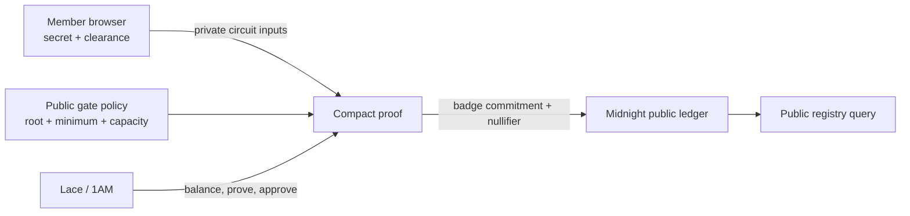
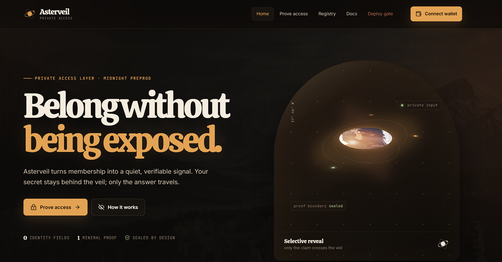
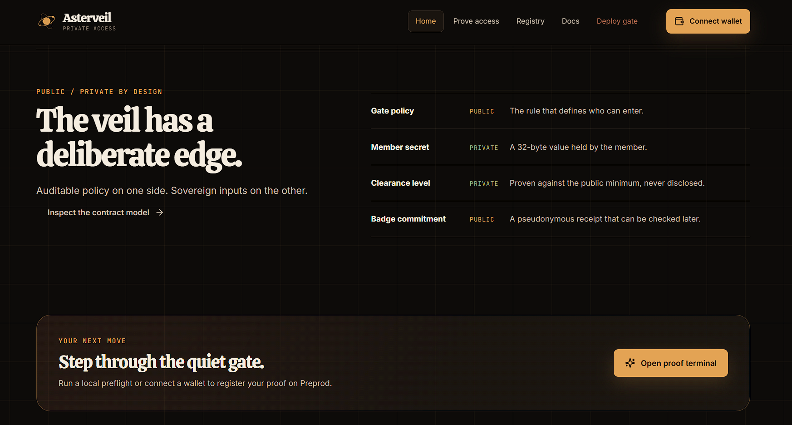
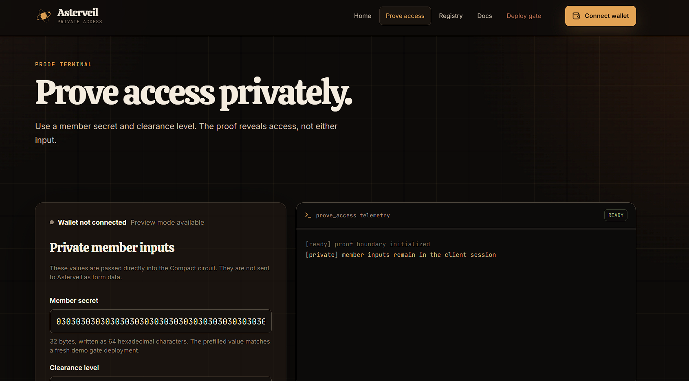
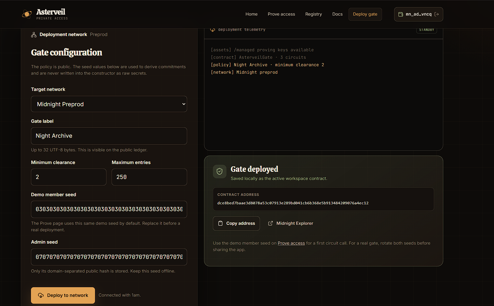
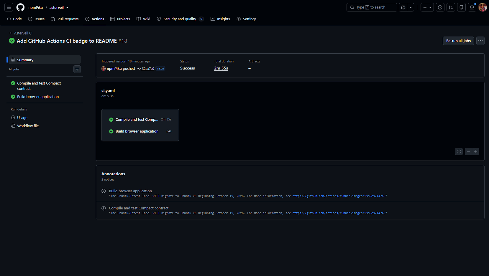

# Asterveil

[](https://github.com/npmPiku/asterveil/actions/workflows/ci.yaml)
A private allowlist gate for trusted circles, built with Compact and Midnight.

Asterveil lets a member prove that they hold an approved membership secret and meet a minimum clearance level without publishing their secret, exact clearance, or identity. The gate records a pseudonymous badge commitment and a replay-resistant nullifier — enough for a verifier to check access without collecting a dossier.


## Product idea

Small research circles, private events, and access-controlled communities often need to answer one question: *does this person belong here?* Today that answer usually means collecting names, documents, or reusable credentials. Asterveil replaces that intake step with a single-use zero-knowledge access proof. A member keeps a 32-byte secret, the gate publishes only a commitment and policy, and a verifier receives a durable access receipt without learning who the member is or how much clearance they hold.

## What is included

- A Compact contract with public gate policy, private member inputs, domain-separated hashes, nullifiers, and a public badge registry.
- Generated `managed/` artifacts: TypeScript bindings, ZKIR circuits, prover keys, and verifier keys.
- React + Vite frontend with a distinct orbital / observatory visual language, responsive layout, and day/night theme toggle.
- Lace/1AM-compatible wallet connection and disconnect flow for Preview and Preprod.
- Browser-based Admin deployment page using `createUnprovenDeployTx` and `submitTxAsync`.
- Proof terminal that calls `prove_access` and displays the observable privacy behavior.
- Registry page that queries the public `badge_registry` through the Midnight indexer.
- Vitest integration tests covering deployment, valid access, rejection/replay, and private-state boundaries.
- CI workflow that compiles the Compact contract, runs the local test suite, and builds the frontend.

## Architecture



## Submission Links

| Resource | Link |
| --- | --- |
| **GitHub Repository** | [npmPiku/asterveil](https://github.com/npmPiku/asterveil) |
| **Live Application** | [asterveil.netlify.app](https://asterveil.netlify.app/) |
| **Demo Video** | [Watch on Google Drive](https://drive.google.com/file/d/1fWISPbUfX6my66jiv1Z70pycOYO_q12N/view?usp=sharing) |
| **Deployed Contract** | [212b4852...](https://explorer.1am.xyz/contract/212b4852304fd522addd1d35fad233e95e318ec8d6e645f4c41d29dfe973d27f?network=preprod) |
| **Deployment TX** | [8a1939cd...](https://explorer.1am.xyz/tx/8a1939cd3b4dd7fbf8a676ae19884d7eb1372d5446695503a36031be460ba536?network=preprod) |
| **X (Twitter) Profile** | [@Asterveilmid](https://x.com/Asterveilmid) |
| **X Post 1** | [View Post](https://x.com/Asterveilmid/status/2104577546352554070?s=20) |
| **X Post 2** | [View Post](https://x.com/Asterveilmid/status/2104577829006725458?s=20) |

## Screenshots

<details>
<summary>Click to view screenshots</summary>







</details>

### The contract

Source: [`contracts/asterveil.compact`](contracts/asterveil.compact)

| Circuit | Purpose |
| --- | --- |
| `prove_access` | Proves membership and clearance, then inserts a public badge commitment and nullifier. |
| `update_gate` | Lets the administrator rotate the allowlist root and public policy with a private admin secret. |
| `set_gate_open` | Opens or closes the gate using the same private admin authorization. |

Pure circuits derive domain-separated member keys, member nullifiers, and admin keys. The generated artifacts live in [`contracts/managed/asterveil`](contracts/managed/asterveil) and must be regenerated rather than hand-edited.

## Privacy model

`disclose()` is a deliberate boundary, not a privacy switch that should be sprinkled through a circuit.

### An observer can learn

- The gate label, allowlist root commitment, minimum clearance, maximum capacity, and open/closed state.
- The number of successful entries.
- That a badge commitment or nullifier was inserted into a public set.
- The contract address, circuit name, transaction metadata, and DUST settlement.

### An observer cannot learn

- The member's 32-byte secret or the preimage of its nullifier.
- The member's exact clearance level.
- A real-world name or identity from the proof itself.
- Private admin secrets used to rotate gate policy.

The browser sends the circuit inputs to the configured proving provider. For production use, use a local proof server or a proving provider you control over an encrypted channel. Do not send private witnesses to an untrusted hosted service.

## Toolchain

The checked build uses the current tested Midnight versions listed by the support matrix:

- Node.js 22+
- Yarn 1.22+
- Compact devtools 0.5.1 with Compact compiler 0.31.1
- Compact runtime 0.16.0
- Midnight.js 4.1.1
- DApp Connector API 4.0.1
- Proof server 8.1.0
- Docker Desktop

Windows development is supported through WSL. The included compile script uses Ubuntu WSL and defaults to the `deep_saha` WSL user because that is the local toolchain configuration used for this workspace. Set `MIDNIGHT_WSL_DISTRO` and `MIDNIGHT_WSL_USER` if your installation differs.

## Local setup

### 1. Install dependencies

```bash
yarn install
cd frontend
npm install
cd ..
```

### 2. Compile the contract

With Compact installed and on your PATH:

```bash
yarn compile
```

The command compiles `contracts/asterveil.compact` and synchronizes the generated directory into:

```text
frontend/src/managed/
frontend/public/managed/
```

The browser must be able to request the proving keys from `/managed`. Do not add either managed directory to `.gitignore`.

### 3. Start the local Midnight services

```bash
yarn env:up
yarn wait:dust
yarn test:local
yarn env:down
```

The Docker stack provides the local node, indexer, and proof server. Integration tests are intentionally serial because proof generation is resource intensive.

### 4. Run the frontend

```bash
cd frontend
npm run dev
```

Open `http://localhost:5173`. The interface works in a marked local preflight mode without a wallet. To submit a real transaction, install Lace or 1AM, connect to Preview/Preprod, and approve the wallet request.

## Browser deployment flow

1. Open **Deploy gate**.
2. Select Preview or Preprod.
3. Connect Lace or 1AM on the same network.
4. Set a gate label, minimum clearance, capacity, member seed, and admin seed.
5. Confirm the constructor summary and click **Deploy to network**.
6. Approve the transaction in the wallet.
7. Asterveil stores the returned address in `localStorage` under `DEPLOYED_CONTRACT_ADDRESS` and updates the active contract bar.
8. Use the address copy control or Midnight Explorer link to verify the deployment.
9. Use the matching member seed on **Prove access** to call `prove_access`.

The browser form's default seeds are for a demonstration deployment only. Replace them before deploying a real gate, and never commit the resulting admin secret. The CLI helper requires `ASTER_VEIL_MEMBER_SECRET_HEX` and `ASTER_VEIL_ADMIN_SECRET_HEX` environment variables rather than embedding secrets in source.

## Environment files

Copy the appropriate template and provide exactly one wallet secret for command-line deployments/tests:

```bash
cp .env.preprod.example .env.preprod
# or
cp .env.preview.example .env.preview
```

Ignored environment files are intentionally not part of the repository. Never place wallet mnemonics, seeds, or admin secrets in a frontend `.env` file.

## Tests and CI

Run the full local integration test suite with:

```bash
yarn test:local
```

The suite covers:

1. Contract deployment and public policy initialization.
2. A valid private membership proof and public badge registration.
3. Rejection of an unknown member and replay of an existing member secret.
4. Absence of member secret and clearance fields from the public ledger representation.

CI is defined in [`.github/workflows/ci.yaml`](.github/workflows/ci.yaml). It compiles the contract, starts Docker services, runs the local test suite, and builds the frontend.

## Submission evidence to add manually

The application and documentation are prepared for the evidence that requires your accounts and wallet:

- `docs/screenshots/compile.png` — successful `compact compile` output with circuits listed.
- `docs/screenshots/deployment.png` — Admin page showing the deployed Preview/Preprod address.
- `docs/screenshots/tests.png` — test output with at least three passing tests.
- `docs/demo/README.md` — final live demo URL and one-minute walkthrough link.
- A public repository URL and at least 15 meaningful commits for Level 4.
- A product X profile URL linked from this README after you create it.


## Level 1–4 cross-check

| Level | Repository implementation | Manual evidence still required |
| --- | --- | --- |
| 1 · New Moon | Toolchain scripts, first Compact contract, generated managed artifacts, tests, setup guide, product idea, privacy model. | Preview/Preprod deployment, visible address, compile/deployment/test screenshots, and five meaningful commits. |
| 2 · Crescent | Wallet connect/disconnect, browser circuit call, observable private input boundary, contract address/explorer surface. | Live hosting URL, verifiable Preprod address, wallet + successful circuit video, and eight meaningful commits. |
| 3 · First Quarter | Private allowlist product proposal, four integration tests, CI workflow, polished responsive UI, registry query, and docs. | A passing CI run screenshot/badge, one-minute demo, approval record, and ten meaningful commits. |
| 4 · Waxing Gibbous | Browser Admin deployer, Preview/Preprod selector, local address persistence, full setup/usage/privacy docs, CI build path. | Live MVP on Preprod, final demo link/video, public X profile, contract address, and fifteen meaningful commits. |

This table is deliberately honest: wallet signatures, public hosting, screenshots, external profile creation, and repository history cannot be manufactured by the codebase.

## Project layout

```text
contracts/
  asterveil.compact
  index.ts
  managed/asterveil/       # generated circuits, keys, and bindings
frontend/
  public/managed/           # generated assets served to the browser
  src/managed/              # generated bindings imported by React
  src/pages/                # Home, Prove, Registry, Admin, Docs
  src/lib/midnight.ts       # browser provider/session factory
scripts/
  compile.js
  copy-managed.js
  deploy.ts
src/
  config.ts
  providers.ts
  wallet.ts
  test/asterveil.test.ts
.github/workflows/ci.yaml
compose.yml
PROPOSAL.md
README.md
```

## Security note

Asterveil demonstrates a privacy-preserving access pattern; it is not a legal identity, access-control, or compliance guarantee. Review the Compact circuit, wallet connector, proving setup, and operational threat model before using real credentials or opening a production gate.

## License

Apache License 2.0. See [`LICENSE`](LICENSE).
